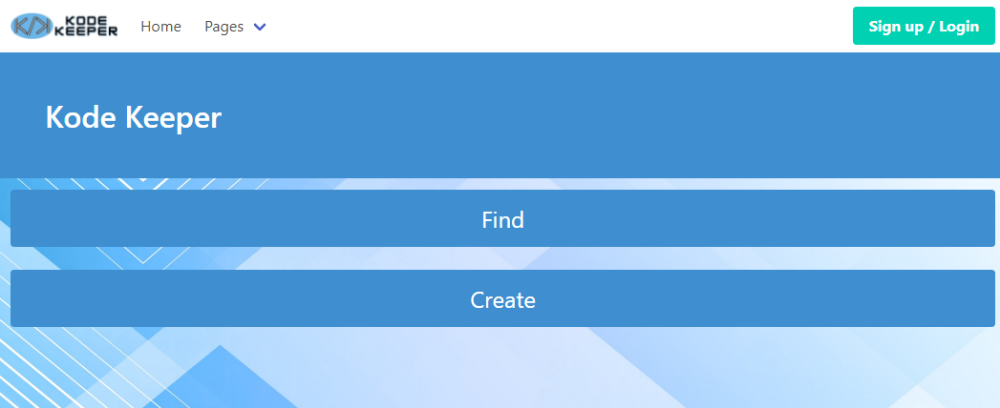
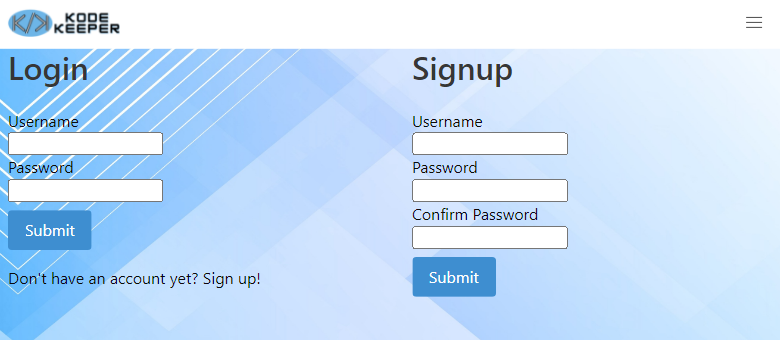
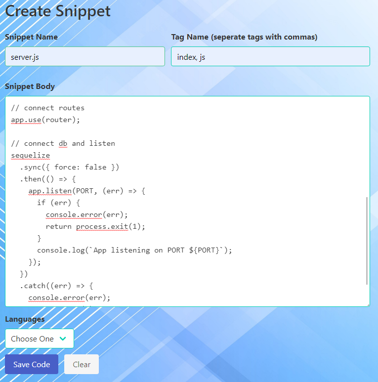
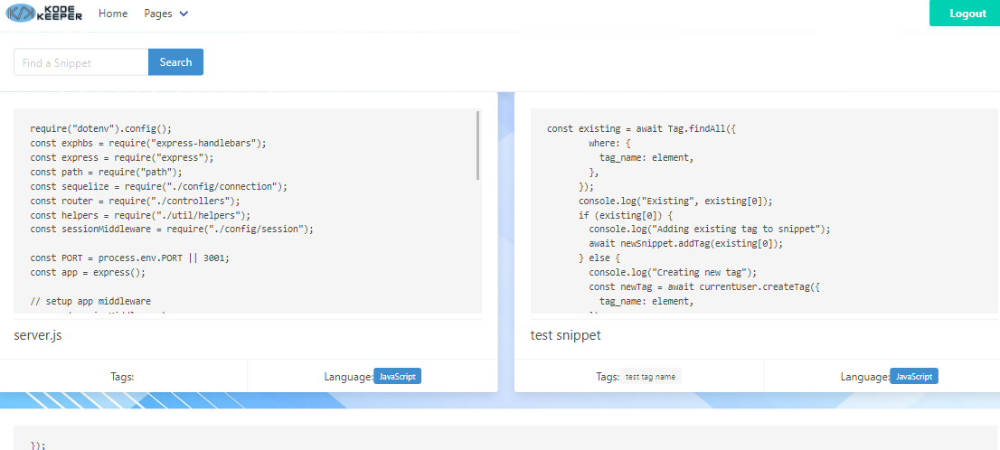

# crypto-launch

## Description

An app for novice crypto investors to quickly find available coins on the market, their current value, and trending news at a glance. The app will provide a more detailed look at the type of cryptocurrency chosen, allowing the user to make investment choices more confidently.

## Installation

No installation necessary. An internet browser is required.

## Usage

1. Point your browswer to <a href="https://kode-keeper.herokuapp.com/">Kode Keeper</a>.

   

2. Login or Sign up.

   

3. Create Snippet. Enter in a name for the snippet, any tags you wish to associate with this snippet, and the snippet body. Select a language from the dropdown menu, and hit Save!

  

4. Once your snippet is saved, navigate to the "Find" page, and view all saved snippets or search for something specific.

  

## Credits

This was a group collaboration with <a href="https://github.com/saml415">Sam Lloyd</a>, <a href="https://github.com/maxd66">Maxwell Dunn</a>, and <a href="https://github.com/m-car">Marko Caric</a>.

Special Thanks to <a href="https://github.com/median-man">John Desrosier</a> for his guidance during this project.
